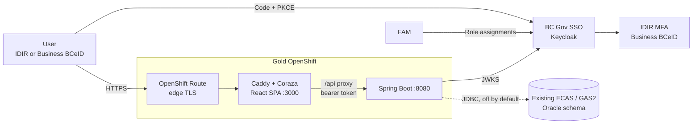
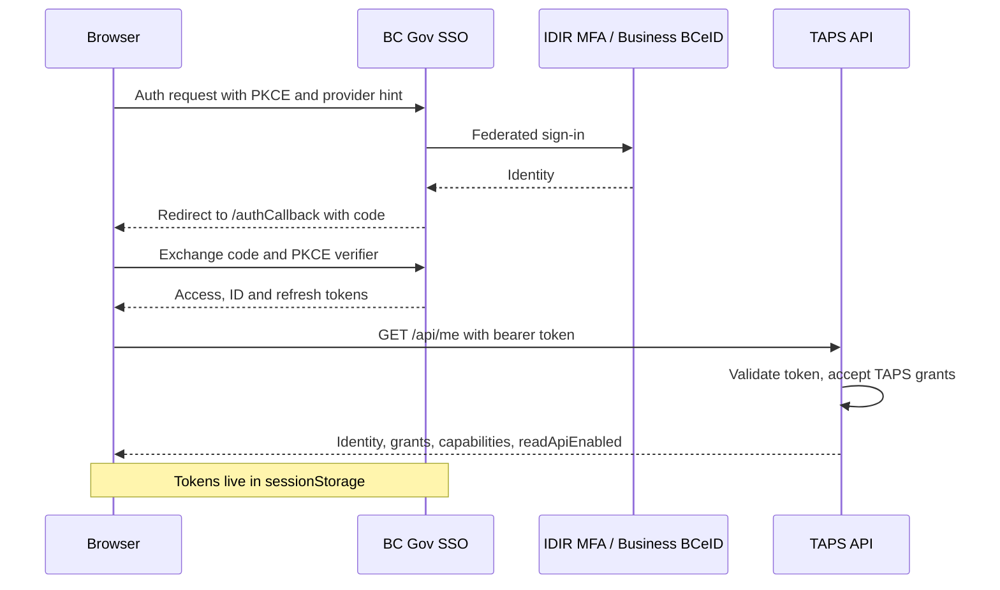
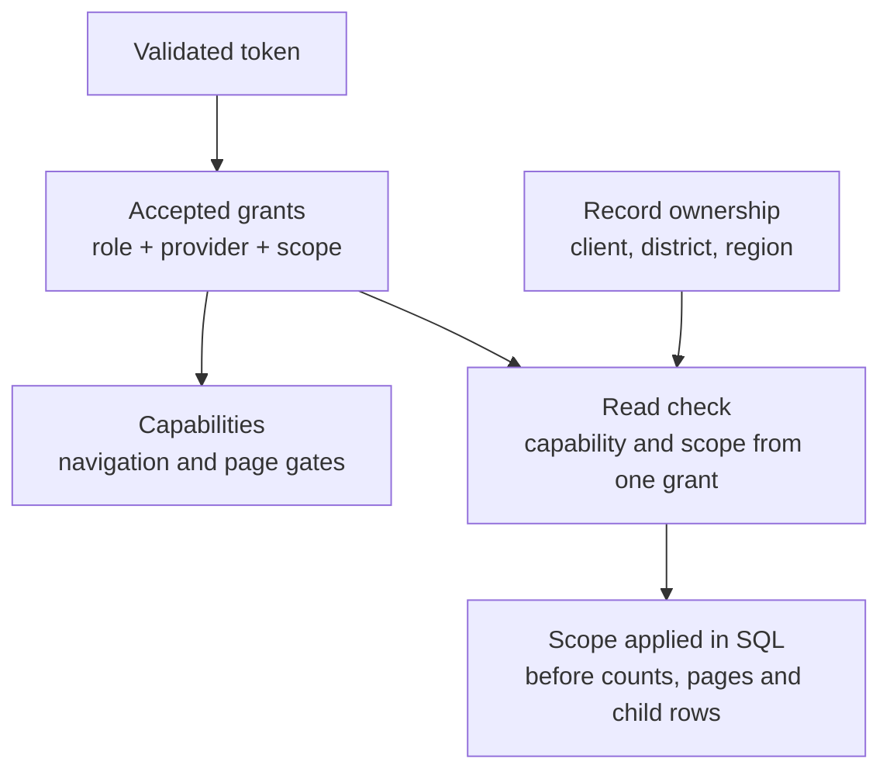
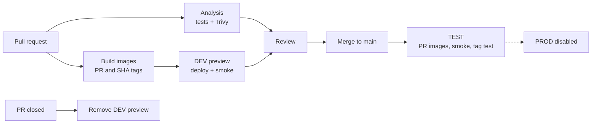

# TAPS architecture

TAPS replaces the Electronic Commerce Appraisal System (ECAS) and the General Appraisal System (GAS2). ECAS and GAS share sign-in, session and authorization but keep separate navigation. The existing Oracle schema and data stay in place and are reached through an application proxy account.

## Runtime

- Only the frontend has a public Route. Caddy serves the SPA, sets security headers, runs Coraza WAF rules and proxies `/api` to the private backend Service.
- The browser is a public OIDC client, so there is no secret in the SPA.
- FAM writes role assignments into Keycloak. The API authorizes from the validated token and doesn't call FAM per request.
- The frontend writes `/config.js` from environment values at startup, so one image runs in DEV and TEST.
- Oracle is off by default. When it's on, the backend won't start unless it can connect.

| Component      | Built                                                                 | Not yet                                    |
| -------------- | --------------------------------------------------------------------- | ------------------------------------------ |
| Frontend       | Session, login, Carbon shell, ECAS/GAS read pages, synthetic preview  | Editing forms, workflow, inactivity warning |
| Caddy / Coraza | Static assets, API proxy, CSP and security headers, WAF, health port  | Testing in DEV/TEST                        |
| Backend        | JWT validation, grants, scoped read endpoints, `/api/me`, health probes | Write endpoints, workflow, transactions  |
| FAM / SSO      | Role and scope model                                                  | TAPS clients and role assignments          |
| Oracle         | Read adapters, disposable-Oracle tests                                | Proxy access, real-data checks             |
| OpenShift / CI | Image builds, DEV/TEST templates, smoke tests, Trivy                  | Namespaces, credentials, sizing            |

There is no service-client API, email, report engine, file scanner or scheduled job yet.

## Frontend

The UI uses Carbon for the header, navigation, tables and side drawer. TanStack Router handles routing. See [UI foundation](ui-foundation.md).

| UI concern          | Carbon package / component              |
| ------------------- | --------------------------------------- |
| Controls and themes | `@carbon/react`                         |
| Detail side drawers | `SidePanel` from `@carbon/ibm-products` |
| Icons               | `@carbon/icons-react`                   |
| Pictograms          | `@carbon/pictograms-react`              |

Use Carbon icons and pictograms unless Carbon has nothing suitable. Keep the official BC Gov branding.

## Authentication

Only IDIR MFA and Business BCeID are supported. [Authentication and authorization](access-and-identity.md) covers token checks and grant formats.

Logout clears local credentials, then chains SiteMinder logoff to Keycloak end-session. Only one token refresh runs at a time, and a late refresh or callback can't restore a session after logout. `invalid_grant`, or a session that can't renew, signs the user out. Network errors keep credentials so the user can retry. The inactivity warning is not built yet.

## Authorization

The backend derives capabilities from [TapsRole](../backend/src/main/java/ca/bc/gov/nrs/taps/security/TapsRole.java) and authorizes every operation. The browser uses capabilities only for display. [RoleGrant](../backend/src/main/java/ca/bc/gov/nrs/taps/security/RoleGrant.java) holds one scope per scoped role: a district, a FAM region or an eight-digit forest-client number. [TapsUser](../backend/src/main/java/ca/bc/gov/nrs/taps/security/TapsUser.java) requires one grant to supply both the capability and the record's scope, so a broad read grant can't widen a scoped write grant.

The Oracle readers apply scope in SQL before counts, pages, direct lookups and child rows. The ADS and per-family ownership mappings are provisional until checked against real data.

New endpoints need their own authorization rules and tests before they're enabled. Writes also need linked-resource scope checks and transaction and concurrency controls. Record integration differences in [technical legacy divergences](intentional-legacy-divergences.md).

## Oracle access

Current endpoints run SELECTs and the inbox's existing client-name function. No legacy write package is called. The readers only register when Oracle is on, and code-list HTTP routes aren't exposed yet. Calculation, write, workflow and bulk-run procedures stay out until their side effects are reviewed.

- [Oracle read foundation](oracle-read-foundation.md): legacy query rules and mappings.
- [Oracle read runtime](oracle-read-runtime.md): settings, grants and health.

Port legacy screens with their ECAS/GAS business behavior against the same tables. A legacy screen stays in use until it is ported.

## Delivery and operations

DEV previews use route slot `PR number modulo 50`, which caps SSO callbacks at 50 hosts. PRs in the same slot share a hostname, and the latest deploy owns the Route. Names and labels keep the real PR number, so cleanup never deletes a Route now owned by a newer PR. Branch protection is set in the repository settings.

Pods don't mount service-account tokens, drop all capabilities, block privilege escalation and use a read-only root filesystem with writable temp volumes. Network policies allow router-to-frontend and same-preview frontend-to-backend traffic. Replicas and resources start small.

Spring's 60-second graceful shutdown plus a 10-second preStop fits in the 90-second termination budget. Caddy turns off upstream connection pooling so requests don't stick to a draining pod. Liveness and readiness use Spring's app state, so a shared database outage doesn't take every pod out. `/actuator/health` includes the database when Oracle is on.

See [deployment configuration](deployment-configuration.md) for SSO and GitHub settings.
