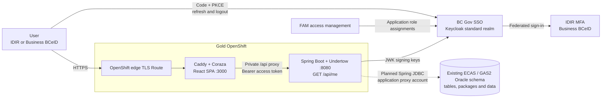
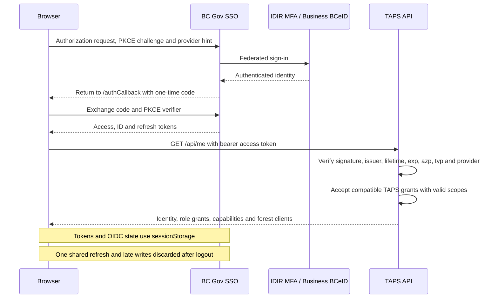
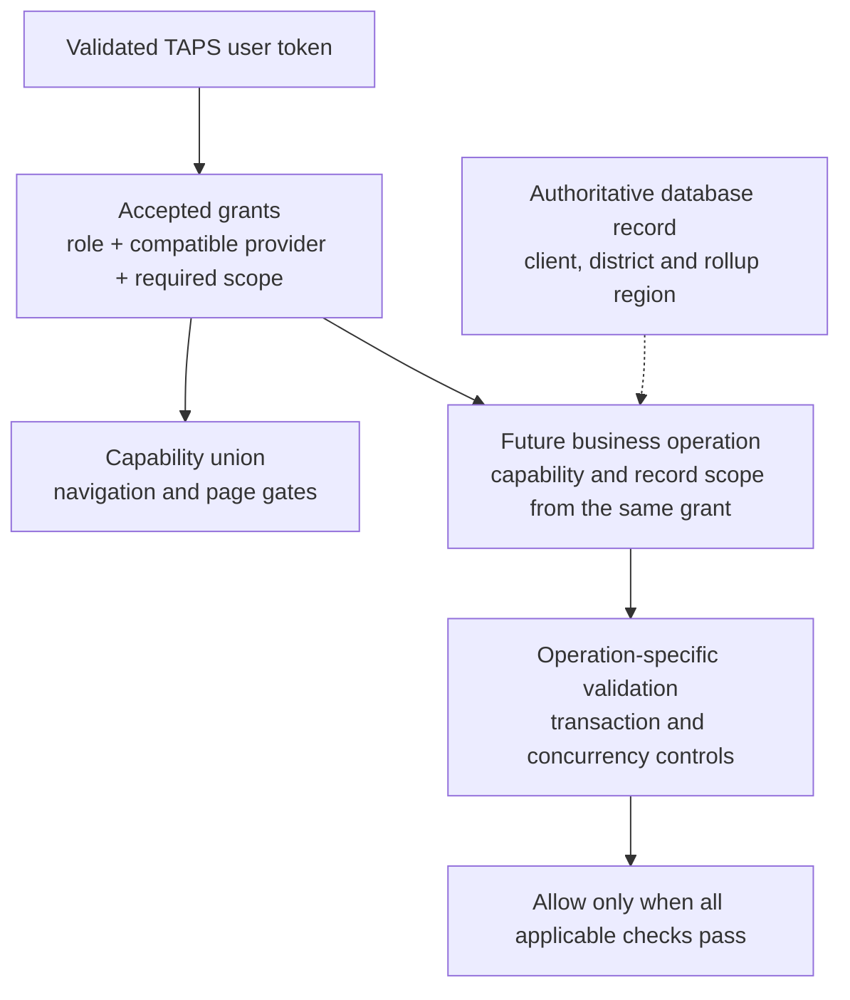
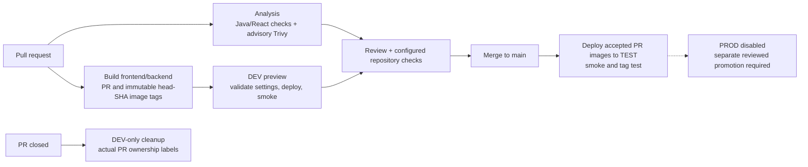

# TAPS architecture

TAPS modernizes the Electronic Commerce Appraisal System (ECAS) and General Appraisal System (GAS2) with FAM authentication and authorization, Spring Boot and React, Gold OpenShift hosting, and GitHub Actions CI/CD. The existing Oracle schema and data remain in place, accessed through an application proxy account.

The initial implementation shares sign-in, session state and authorization while retaining separate ECAS and GAS navigation.

## Runtime and trust boundaries

The foundation implements the application and deployment templates. Oracle connectivity through the application proxy account remains to be implemented; environment configuration and deployed acceptance are required before release.

Only the frontend has a public Route. Caddy serves the SPA, applies browser security headers and Coraza rules, and proxies API traffic to the private backend Service. The browser obtains its own access token using a public client; a client secret is not placed in the SPA. FAM provisions role assignments in CSS/Keycloak; the API authorizes from the validated token, without calling FAM for every request.

| Component                  | Implemented responsibility                                                                                              | Deferred responsibility                                                                           |
| -------------------------- | ----------------------------------------------------------------------------------------------------------------------- | ------------------------------------------------------------------------------------------------- |
| React frontend             | Shared session, IDIR/Business BCeID login, accepted-grant display, capability-gated ECAS/GAS links and five page shells | Carbon components/theming, working forms, searches, record views and inactivity-warning UX        |
| Caddy / Coraza             | Static assets, API proxy, CSP/security headers, credential-safe log configuration, WAF and health endpoint              | Container/WAF runtime acceptance in DEV/TEST                                                      |
| Spring Boot / Undertow     | JWT validation, principal/grant conversion, capability and record-scope helpers, `/api/me`, health probes               | Business endpoints, authoritative record ownership, workflow validation and transactions          |
| FAM / BC Gov SSO           | Integration and role-assignment model supported by the application                                                      | TAPS clients, approved role definitions/assignments and credentialed acceptance                   |
| Oracle                     | Existing ECAS/GAS2 schema, tables, data and package contracts to be reused                                              | Driver, approved proxy access, connection configuration and repository queries                    |
| GitHub Actions / OpenShift | Image build, DEV preview/TEST deployment templates, smoke checks, quality checks and advisory security scan             | Provisioned namespaces, deployment credentials, actual CI/rollout evidence and operational sizing |

No service-client API, mail delivery, report engine, file scanner or scheduled business process is configured in this foundation. Add those integrations when their TAPS requirements and ownership are established.

## Frontend design system

Carbon Design System is the target UI framework, following the LEXIS interface. The current React scaffold uses Bootstrap and BC Gov components; Carbon integration remains to be implemented. TanStack Router continues to handle application routing.

| UI concern          | Carbon package / component              |
| ------------------- | --------------------------------------- |
| Controls and themes | `@carbon/react`                         |
| Detail side drawers | `SidePanel` from `@carbon/ibm-products` |
| Icons               | `@carbon/icons-react`                   |
| Pictograms          | `@carbon/pictograms-react`              |

Follow LEXIS's responsive drawer and focus-management pattern. Prefer Carbon icons and pictograms over other icon libraries or hand-drawn SVGs; use alternatives only when Carbon has no suitable asset. Retain official BC Gov branding assets.

## Authentication

The supported account types are **IDIR MFA and Business BCeID**. Basic BCeID is unsupported. See [authentication and authorization](access-and-identity.md) for token validation, grant formats and scope enforcement.

The API requires a token signed by the configured issuer, a present expiry, the configured client in `azp`, bearer token type, a supported provider and a usable provider-specific user identity. Realm roles and other clients' roles confer no TAPS access. Unknown/malformed grants, missing required scopes and FAM management/metadata roles confer no application permission.

A valid sign-in without a TAPS role receives an empty access list from `/api/me`, allowing the UI to explain how to request access. Public health probes are available; other application paths default to denied until their route policy is implemented. The API is stateless and bearer-only; it does not authenticate from browser cookies or HTTP Basic.

Logout removes local credentials and chains the configured SiteMinder logoff to Keycloak end-session. Session generation checks prevent an in-flight storage read, refresh or callback from restoring a cleared session. `invalid_grant` and an unrenewable expiring session end local access; transport/temporary SSO failures preserve stored credentials for retry. The full application inactivity-warning/logout policy is still to be implemented and accepted.

## Authorization

The backend derives capabilities from [TapsRole](../backend/src/main/java/ca/bc/gov/nrs/taps/security/TapsRole.java). The browser uses the capability union for presentation. The backend must authorize every operation independently.

[RoleGrant](../backend/src/main/java/ca/bc/gov/nrs/taps/security/RoleGrant.java) accepts one scope dimension per scoped role: district, current FAM region, or an eight-digit forest-client number. Multiple grants may authorize different places and actions. [TapsUser](../backend/src/main/java/ca/bc/gov/nrs/taps/security/TapsUser.java) checks that one grant supplies both the requested capability and the relevant record scope. Broad read access cannot expand a separate scoped write grant.

The record-scope helper is tested with synthetic records, but has no database-backed consumers yet. When adding endpoints, load scope from the record and its authoritative parents/relationships; enforce scope in lists, counts, reports and direct-ID reads. Validate linked-resource scope on creation. State-changing operations also need operation-specific validation and concurrency checks under the transaction or lock. A role or visible button alone is insufficient.

The current role mappings support the access scaffold. New endpoints require validated authorization and acceptance tests before they are enabled. Record implemented integration differences in [technical legacy divergences](intentional-legacy-divergences.md).

## Existing Oracle access

TAPS will use an application proxy account with approved privileges to access the existing Oracle schema, tables and stored procedures. The data and record identifiers remain in place; no data migration is planned.

Start with low-risk, parameterized lookup reads once proxy access is available. Preserve projection, effective/expiry filters, ordering and null/date semantics when implementing queries. Keep calculation, write, workflow and bulk-run procedure calls until their side effects and transaction contracts have been reviewed.

Port legacy screens and application logic to React and Spring Boot while preserving ECAS/GAS business behavior against the existing tables. Browser RPC and organization-context handoffs can become server-side coordination. Similar screen names do not establish equivalent behavior, and an unported screen has not been retired.

## Delivery and operations

DEV uses public slots `PR number modulo 50`, while workload names and ownership labels retain the actual PR number. This bounds SSO callbacks to 50 hosts. PRs that share a slot share its hostname; the latest deployment owns the reused Route. Cleanup selects the closed PR's labels, so it does not delete a reused Route owned by a newer PR.

The diagram shows the delivery lifecycle; Analysis and image builds are separate workflows/jobs. Repository branch-protection requirements must be configured separately. Current merge delivery uses PR-numbered images; synchronize the branch and rebuild after `main` advances before treating an older green PR image as the accepted candidate.

Pods disable service-account token mounting, privilege escalation and Linux capabilities, and use read-only root filesystems with writable temporary volumes. Ingress policies permit router-to-frontend and same-preview frontend-to-backend traffic. Starter replicas/resources are small; HA, quotas, metrics and scale choices require evidence from the provisioned environment.

Spring's 60-second graceful shutdown plus a 10-second preStop fits within the 90-second pod termination budget. Caddy disables upstream connection pooling to avoid pinning requests to a draining pod. These settings are configuration/local-process proof, not deployed rolling-availability acceptance.

See [deployment configuration](deployment-configuration.md) for SSO request fields, callbacks and GitHub variables/secrets, and the [README](../README.md) for development and checks.
