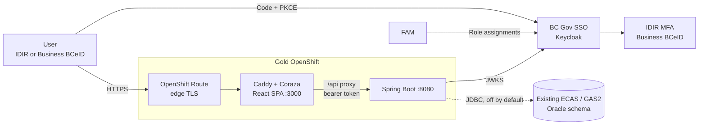
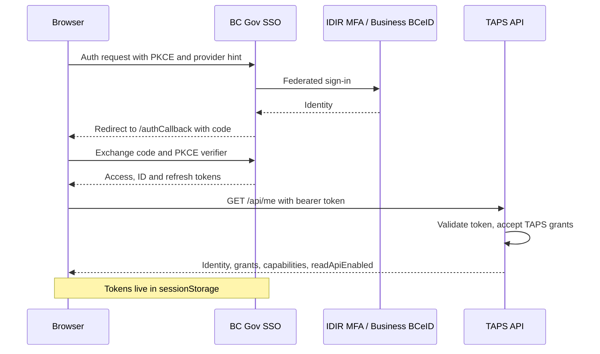
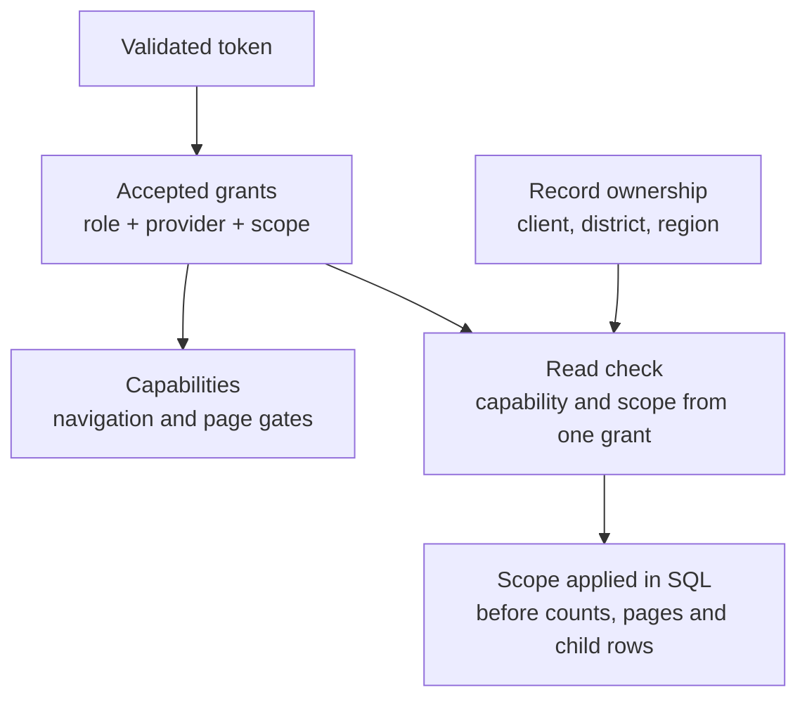

# TAPS architecture and access

TAPS replaces the Electronic Commerce Appraisal System (ECAS) and the General Appraisal System (GAS2). ECAS and GAS share sign-in, session and authorization but keep separate navigation. The existing Oracle schema and data stay in place and are reached through an application proxy account.

## Runtime

- Only the frontend has a public Route. Caddy serves the SPA, sets security headers, runs Coraza WAF rules and proxies `/api` to the private backend Service.
- The browser is a public OIDC client, so there is no secret in the SPA.
- FAM writes role assignments into Keycloak. The API authorizes from the validated token and doesn't call FAM per request.
- The frontend writes `/config.js` from environment values at startup, so one image runs in DEV and TEST.
- Oracle reads run only with the backend's `oracle` Spring profile, which is off by default. With it on, the backend won't start unless it can connect.

The frontend uses Carbon and TanStack Router; see [UI development](ui-foundation.md). After a redeploy, a tab requesting a missing code chunk reloads to pick up the new build, at most once a minute.

Implementation status is maintained in the [repository README](../README.md#current-status).

## Authentication

The public browser client uses code + PKCE with provider hints `azureidir` and `bceidbusiness`. Basic BCeID is unsupported. The backend accepts bearer tokens only, not cookies. Issuer, client and callback settings are in [deployment configuration](deployment-configuration.md#sso-request).

Logout clears local credentials, then chains SiteMinder logoff to Keycloak end-session. Only one token refresh runs at a time, and a late refresh or callback can't restore a session after logout. A 401 from the API, `invalid_grant`, or a token that can't be renewed signs the user out straight away. Network errors keep credentials so the user can retry. Sign-in returns the user to the page they started from; only same-origin paths are accepted. The inactivity warning is not built yet.

### Token and grant validation

The API checks the token signature, issuer, lifetime, expiry, client (`azp`), type (`typ`) and identity provider. Roles come from CSS `client_roles`, or from the client's Keycloak `resource_access` entry when `client_roles` is missing. Role-to-capability mappings live in [TapsRole.java](../backend/src/main/java/ca/bc/gov/nrs/taps/security/TapsRole.java).

Signing keys come from the issuer's JWKS endpoint with 10-second connect and 15-second read timeouts, one retry and a cache that refreshes ahead of expiry, so a slow key fetch doesn't fail a request.

These grant nothing: malformed claims, unknown roles, wrong providers, FAM management roles and `FAM:` metadata roles. Role names, provider names and scope values are case sensitive.

## Authorization

The backend derives capabilities from [TapsRole](../backend/src/main/java/ca/bc/gov/nrs/taps/security/TapsRole.java) and authorizes every operation. The browser uses capabilities only for display. [RoleGrant](../backend/src/main/java/ca/bc/gov/nrs/taps/security/RoleGrant.java) holds one scope per scoped role: a district, a FAM region or an eight-digit forest-client number. [TapsUser](../backend/src/main/java/ca/bc/gov/nrs/taps/security/TapsUser.java) requires one grant to supply both the capability and the record's scope, so a broad read grant can't widen a scoped write grant.

The Oracle readers apply scope in SQL before counts, pages, direct lookups and child rows. The ADS and per-family ownership mappings are provisional until checked against real data.

### Scope format

| Scope         | FAM marker          | Example (synthetic)                              |
| ------------- | ------------------- | ------------------------------------------------ |
| District      | `HAS_DISTRICT_ROLE` | `TAPS_VIEWER_DISTRICT-DZZ`                       |
| Region        | `HAS_REGION_ROLE`   | `TAPS_REGION_APPRAISER_REGION-KOOTENAY_BOUNDARY` |
| Forest client | `HAS_FOREST_CLIENT` | `TAPS_LICENSEE_VIEWER_FOREST_CLIENT-99990001`    |

- District codes match `D[A-Z]{2}`. Forest-client numbers are eight digits, leading zeroes kept.
- A scoped grant needs exactly one matching suffix with a valid value. Missing or extra suffixes grant nothing.
- Region grants use FAM's `HAS_REGION_ROLE` convention and region codes, including ones with underscores like `KOOTENAY_BOUNDARY`. TAPS has no region model of its own.
- `FamRegion` maps FAM region codes to the Oracle organization rollup. That mapping still needs checking against real data.

ECAS draft and scenario visibility is a separate status rule, applied per grant by `EcasReadPredicate` for inbox and reference reads. Ministry viewers don't see drafts. Client-scoped roles don't see scenarios; for the client viewer this is provisional, to match the other industry roles. TAPS doesn't change any FAM role definitions or assignments.

### Enforcement

`GET /api/me` returns identity, grants, capabilities, forest clients and `readApiEnabled`; no TAPS role produces an empty access list. Health probes are public. Business routes require the `oracle` profile and the [route capability](oracle-reads.md#http-routes); other paths are denied.

The security filter and controller both check the capability, then the reader applies record scope. Report-only access does not allow GAS worksheet reads. Filters only narrow results, and missing and unauthorized records both return 404. New endpoints need authorization rules and tests; future writes also need linked-resource scope, state, transaction and concurrency controls.

## Legacy integration

TAPS reuses the existing schema and preserves ECAS/GAS business behavior. Low-risk reads use parameterized SELECTs and the existing inbox client-name function. No legacy write package is called. Calculation, write, workflow and bulk-run procedures remain in the legacy systems until their side effects and replacement behavior are reviewed.

[Read API and Oracle behavior](oracle-reads.md) records the query mappings and intentional differences. Complete [DEV/TEST activation acceptance](deployment-configuration.md#activation-acceptance) before enabling shared-environment reads. Each legacy workflow remains in use until its replacement has passed parity checks and has a rollback plan.
